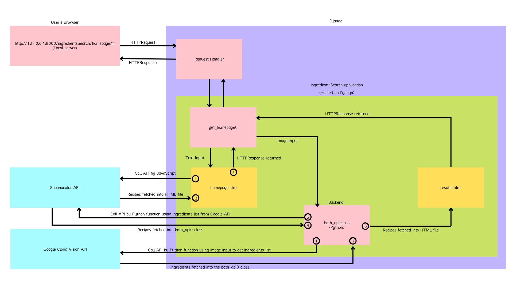

# CS222 Group 36's Project: Cooking Recipe Web Application

  <a href="#introduction">Introduction</a> •
  <a href="#presentation">Presentation</a> •
  <a href="#technical-architecture">Technical Architecture</a> •
  <a href="#installation-instructions">Installation Instructions</a> •
  <a href="#group-members-and-roles">Group Members and Roles</a>

## Introduction
Cooking Recipe Web Application let users search for recipes by either typing their ingredients list as a text, or upload a photo of their fridges and let us take care of the object recognition.

This project is motivated by the difficulty to think about what to cook during the COVID-19 pandemic, so we want to inspire users on what they can cook using the ingredients in their refrigerators. 

## Presentation

- See our project presentation at [Presentation](https://mediaspace.illinois.edu/media/t/1_jt1osqqr)

## Technical Architecture

  

All of our functionality are written in Python, except for `homepage.html` and `request.html` which are written in HTML, CSS, and JavaScript. Contributions of each member can be found in <a href="#group-members-and-roles">Group Members and Roles</a>.

More details of each component can be found below:

### Backend
1. `spoonacular_api.search_recipe_by_ingredients()`

This function takes a list of ingredients that the user want to search, and call the Spoonacular API to retrieve a list of possible recipes.

2. `both_api.get_recipe_from_cloud()`

This function takes an image url, and returns possible recipes. It first calls `detect_label_from_url()` to create labels for the `google_api` class, and then it retrieves the labels using `get_labels()`. After that, it calls `get_recipe_from_spoon()` in order to retrieve the top recipe.

3. `both_api.get_recipe_from_local()`
 
This function takes a local image path, and returns possible recipes. Its functionality is the same as `both_api.get_recipe_from_cloud()`

4. `both_api.get_labels_as_string_from_local()`

This function takes a local image path, and returns a properly formatted string of ingredients. It first calls `detect_label_from_local()` to create labels for the `google_api` class, and then it retrieves the labels using `get_labels()`. From there, it iterates over each label and adds them to the returned string with each ingredient separated by a comma and a space.

5. `both_api.get_recipe_from_spoon()`

This function takes a list of strings as input, and return recipes information. First, it combines the list of strings into one string, separated by commas. Then, It calls the `spoonacular_api.search_recipe_by_ingredients()` to receive recipe information.

6. `google_cloud_vision_api.detect_label_from_url()`

This function takes a url of an image as input, and calls the Google Cloud Vision API to detect the objects in the image. It returns the possible objects and their confidence scores.

7. `google_cloud_vision_api.detect_label_from_local()`

This function takes an image path (not url) as input, and calls the Google Cloud Vision API to detect the objects in the image. It returns the possible objects and their confidence scores.

8. `google_cloud_vision_api.print_label()`

This function is used to test the Google Cloud Vision API outputs. It loops through each label, and print each label name followed by a colon and then the label score, in descending order.

9. `google_cloud_vision_api.get_labels()`

This function takes no parameters, and returns the labels of the image. It simply returned all keys returned from the Google Cloud Vision API as a vector.

### Frontend
10. `views.get_homepage()`

This function handles the HTTP requests from users' browser, and renders back appropriate HTML file.

11. `addSelectButton()`

This function creates a button that pops up next to each recipe's image in each search, containing hyperlink to each recipe's source. The function makes a request for the image url from Spoonacular API, and put it as innerHTML of the button.

12. `addSummary()`

This function creates a summary underneath each recipe's image in each search. The function makes a request for the recipe's summary from Spoonacular API, and populate it on the HTML file.

13. `populateImageandLink()`

This function populates the hyperlink button and the summary for each recipe. The function loops through each recipe's ID, and calls `addSelectButton()` and `addSummary()`. It utilizes Promise to make sure that the button are populated in the correct order despite of the asynchronousity of JavaScript.

14. `getRecipeByIngredients_Many()`

This function makes a request to get all recipes found with the given ingredients input. It then calls `populateImageandLink()` on success which will fill the screen with all aspects needed.

15. `getRecipeByIngredients_Five()`

This function makes a request to get the top 5 recipes found with the given ingredients input. It then calls `populateImageandLink()` on success which will fill the screen with all aspects needed.

16. `getRecipeByIngredients_One()`

This function makes a request to get top 1 recipes found with the given ingredients input. It then calls `populateImageandLink()` on success which will fill the screen with all aspects needed.

## Installation Instructions
1. Open your command line interface (i.e. Terminal)
2. Install `homebrew` (if needed) by running `/bin/bash -c "$(curl -fsSL https://raw.githubusercontent.com/Homebrew/install/HEAD/install.sh)"`
3. Run `brew install git`
4. Run `brew install python3`
5. Run `pip install Django`
6. Run `pip install spoonacular`
7. Run `pip install google-cloud-vision`
8. Run `git clone https://github.com/CS222-UIUC/course-project-group-36.git`
9. Run `cd course-project-group-36/backend`
10. Run `python manage.py runserver`
11. Open up a web browser, and navigate to `http://127.0.0.1:8000/ingredientsSearch/homepage`

## Group Members and Roles
- Rachanon (Andrew) Petchoo (`petchoo2`): 
  - Backend
  - Text-input functionality for the Frontend
- Xianrui Zhong (`xzhong23`): 
  - Backend
  - Image-input functionality for the Frontend 
- Connor Flynn (`cjflynn22`): 
  - Backend
  - Interactive User Interface for the Frontend
